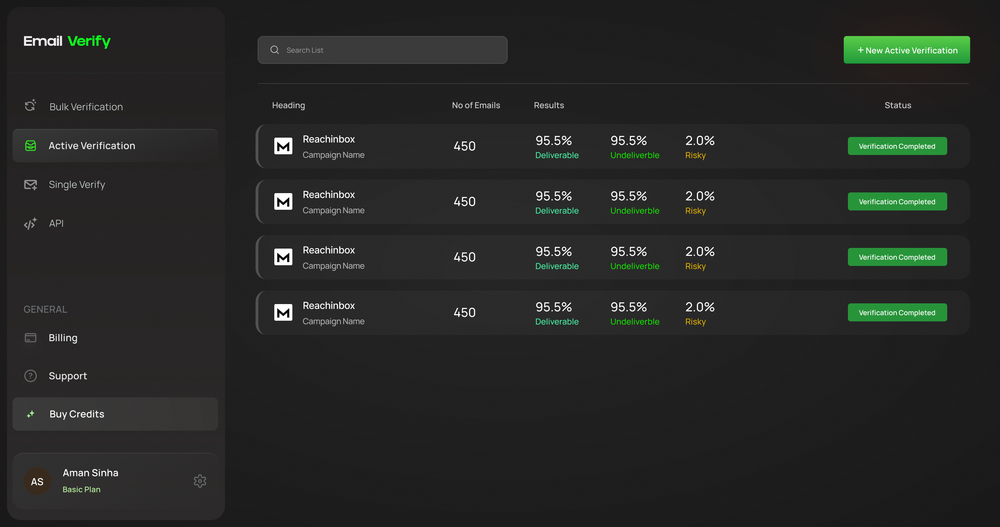

# Active Verification Pages - Figma Design

## Figma Source
- **File**: Emailkit
- **File Key**: r2m4Md3beV9KoBbu3ICOR9

| Page | Node ID | URL |
|------|---------|-----|
| Empty State | 2001:18132 | [Open](https://www.figma.com/design/r2m4Md3beV9KoBbu3ICOR9/Emailkit?node-id=2001-18132&m=dev) |
| Connect Data Source | 2001:19169 | [Open](https://www.figma.com/design/r2m4Md3beV9KoBbu3ICOR9/Emailkit?node-id=2001-19169&m=dev) |
| ReachInbox Login | 2001:19592 | [Open](https://www.figma.com/design/r2m4Md3beV9KoBbu3ICOR9/Emailkit?node-id=2001-19592&m=dev) |
| Dashboard List | 2001:18516 | [Open](https://www.figma.com/design/r2m4Md3beV9KoBbu3ICOR9/Emailkit?node-id=2001-18516&m=dev) |
| Single Item View | 2001:18931 | [Open](https://www.figma.com/design/r2m4Md3beV9KoBbu3ICOR9/Emailkit?node-id=2001-18931&m=dev) |
| Overview Tab | 2001:22519 | [Open](https://www.figma.com/design/r2m4Md3beV9KoBbu3ICOR9/Emailkit?node-id=2001-22519&m=dev) |
| Email Tab | 2001:23092 | [Open](https://www.figma.com/design/r2m4Md3beV9KoBbu3ICOR9/Emailkit?node-id=2001-23092&m=dev) |
| List View (All Campaigns) | 2001:18705 | [Open](https://www.figma.com/design/r2m4Md3beV9KoBbu3ICOR9/Emailkit?node-id=2001-18705&m=dev) |

---

## List View Page (2001:18705)

### Screenshot


### Layout
```
+------------------------------------------------------------------+
|  [Sidebar]  |  [Q Search List____________] [+ New Active Verif.]  |
|             |  ──────────────────────────────────────────────────|
|  Bulk Verif.|  Heading       No of Emails  Results        Status |
|  Active Ver*|  ──────────────────────────────────────────────────|
|  Single Ver.|  +--------------------------------------------+    |
|  API        |  | [M] Reachinbox  450   95.5%  95.5%  2.0%  |    |
|             |  |     Campaign          Deliv. Undel. Risky |    |
|  ─────────  |  |               [Verification Completed]    |    |
|  GENERAL    |  +--------------------------------------------+    |
|  Billing    |  +--------------------------------------------+    |
|  Support    |  | [M] Reachinbox  450   95.5%  95.5%  2.0%  |    |
|  Buy Credits|  |     Campaign          Deliv. Undel. Risky |    |
|             |  |               [Verification Completed]    |    |
|  ─────────  |  +--------------------------------------------+    |
|  [User]     |  ...                                               |
+------------------------------------------------------------------+
```

### Table Component

#### Table Headers
| Column | Width | Text Style |
|--------|-------|------------|
| Heading | 237px | 12px SemiBold #C6C6C6 |
| No of Emails | 94px | 12px SemiBold #C6C6C6 |
| Results | ~252px | 12px SemiBold #C6C6C6 |
| Status | ~111px | 12px SemiBold #C6C6C6 |

#### Table Row Card
```css
.campaign-row {
  background: rgba(255, 255, 255, 0.03);
  border-left: 4px solid #515151;
  border-radius: 16px;
  height: 64px;
  padding: 11px 20px;
  gap: 24px;
}
```

#### Heading Column (with Integration Icon)
```css
.heading-cell {
  display: flex;
  gap: 12px;
  align-items: center;
  width: 237px;
}

.integration-icon {
  width: 32px;
  height: 32px;
}

.integration-name {
  font-family: 'Inter', sans-serif;
  font-weight: 500;
  font-size: 14px;
  color: #FFFFFF;
  letter-spacing: -0.28px;
}

.campaign-name {
  font-family: 'Manrope', sans-serif;
  font-weight: 500;
  font-size: 12px;
  color: #B3B3B3;
  letter-spacing: -0.24px;
}
```

#### Results Column (Sub-columns)
| Metric | Value Color | Label | Label Color |
|--------|-------------|-------|-------------|
| Deliverable | #FFFFFF (18px) | "Deliverable" | #48F4A5 (12px) |
| Undeliverable | #FFFFFF (18px) | "Undeliverble" | #14E101 (12px) |
| Risky | #FFFFFF (18px) | "Risky" | #E1B001 (12px) |

#### Status Badges
| Status | Background | Text |
|--------|------------|------|
| Verification Completed | #28943A | 10px SemiBold white |

#### Search Input
```css
.search-input {
  background: #3B3B3B;
  border-radius: 8px;
  padding: 12px 17.77px;
  width: 360px;
  box-shadow: inset 0px 0px 0px 0.971px #4D4D4D;
}

.search-placeholder {
  color: #A1A1A1;
  font-size: 10.185px;
}
```

#### New Active Verification Button
```css
.new-active-verification-btn {
  background: linear-gradient(180deg, #5ACE49 0%, #229A3C 100%);
  border-radius: 4px;
  padding: 12px 20px;
  width: 182px;
  box-shadow: 0px 0px 100px 0px rgba(255,71,0,0.15);
}
```

---

## Feature Overview

**Active Verification** is a continuous email verification feature that connects to external email tools (Reachinbox, Smartlead, Instantly, etc.) and automatically verifies emails from those sources on a schedule.

### Key Differences from Bulk Verify

| Aspect | Bulk Verify | Active Verification |
|--------|------------|---------------------|
| **Input Method** | CSV upload or manual paste | Connect to external email tools |
| **Verification Type** | One-time batch verification | Continuous/scheduled verification |
| **Flow** | Upload → Map → Verify → Export | Connect source → Auto-sync → Verify |
| **Tabs** | Overview, Email, Exports, Settings | Overview, Email, Cleanup, Settings, **Schedule** |
| **CTA Button** | "+ New List" | "+ New Active Verification" |

---

## Design System

### Color Palette (Active Verification specific)

| Token | Hex | Usage |
|-------|-----|-------|
| Modal Background | #262624 | Modal card background |
| Card Background | #343433 | Content cards |
| Input Background | #323230 | Form input fields |
| Input Border | #4d4d4d | Input field borders |
| Search Background | #3b3b3b | Search input field |
| Integration Card BG | #262624 | Non-selected integration card |
| Integration Card Selected | #583a2d | Selected integration (Reachinbox) |
| Integration Card Border | #404034 | Default card border |
| Integration Card Selected Border | #1aff4c | Selected card border |
| Coming Soon Badge BG | #313e45 | "Coming Soon" badge background |
| Coming Soon Text | #2ba7e4 | "Coming Soon" badge text |
| Status Completed BG | #28943a | "Verification Completed" badge |
| Status In Progress BG | #504843 | "Verification In Progress" badge |

### Status Badge Colors (Overview Tab)

| Status | Badge BG | Text Color |
|--------|----------|------------|
| Deliverable | #3b4f46 | #49ffac |
| Invalid | #4f4d3b | #e1b001 |
| Risky | #3c4f3b | #14e101 |
| Unknown | #3b3f4f | #bb69eb |

### Progress Bar Gradients (Same as Bulk Verify)

| Status | From | To |
|--------|------|-----|
| Deliverable | #1edf6b | #10793a |
| Risky (purple) | #361fcb | #1b0f65 |
| Unknown (green) | #5cd34a | #2b6d26 |
| Undeliverable (yellow) | #e4b14e | #7e622b |

### Donut Chart Colors

| Category | Arc Color | Count Color |
|----------|-----------|-------------|
| Deliverable | #49ffac (green) | #49ffac |
| Invalid | #e1b001 (yellow) | #e1b001 |
| Risky | #14e101 (bright green) | #14e101 |
| Unknown | #bb69eb (purple) | #bb69eb |

### Typography

| Element | Font | Size | Weight | Color |
|---------|------|------|--------|-------|
| Modal Title | Inter Semi Bold | 24px | 600 | #cacaca |
| Modal Subtitle | Manrope Medium | 14px | 500 | #98999c |
| Section Title | Manrope SemiBold | 16px | 600 | #b6b6b6 |
| Integration Name | Inter Medium | 14px | 500 | #ffffff |
| Integration Type | Manrope Medium | 12px | 500 | #b3b3b3 |
| Link Text | Manrope Medium | 14px | 500 | #1aff4c |
| Tab Active | Manrope Bold | 13px | 700 | #0dff1d |
| Tab Inactive | Manrope Regular | 13px | 400 | #e1e0e0 |
| Stats Label | Manrope Medium | 12px | 500 | #c2c2c2 |
| Stats Value | Manrope Medium | 18px | 500 | #ffffff |
| Donut Center % | Open Sans Bold | 24px | 700 | #edeff4 |

### Shadow Styles

```css
/* Modal Container Shadow */
box-shadow:
  0px 3.886px 7.771px rgba(0,0,0,0.09),
  0px 7.771px 15.542px rgba(0,0,0,0.09),
  0px 15.542px 31.085px rgba(0,0,0,0.12),
  0px 31.085px 62.169px rgba(0,0,0,0.15),
  0px 62.169px 124.339px rgba(0,0,0,0.18);

/* Modal Inner Border */
box-shadow: inset 0px 0px 0px 0.486px rgba(255,255,255,0.05);
```

---

## Page Designs

### 1. Active Verification Empty State

**Route**: `/home/active-verification` (when no integrations connected)

```
┌──────────────────────────────────────────────────────────────────────┐
│                                                                      │
│                          ┌────────┐                                  │
│                          │  ↻✨   │                                  │
│                          └────────┘                                  │
│                                                                      │
│              Get Started with Active Verfication                     │
│                                                                      │
│                Start Verifying Emails in Minutes!                    │
│                                                                      │
│     Ready to take your email verification to the next level?         │
│     Our simple, JSON-based API makes it a breeze! With just a        │
│     few lines of code, you can integrate our powerful email          │
│     verification capabilities into your applications and start       │
│     ensuring your outreach hits the mark.                            │
│                                                                      │
│                      ┌─────────────────┐                             │
│                      │      Verify     │                             │
│                      └─────────────────┘                             │
│                                                                      │
└──────────────────────────────────────────────────────────────────────┘
```

**Icon**
- Refresh icon with sparkles (different from Bulk Verify envelope icon)
- Background: rgba(255,164,58,0.1)
- Size: 64px container

**Typography**
| Element | Style |
|---------|-------|
| Title | Manrope Bold 24px, #ffffff, "Get Started with Active Verfication" |
| Subtitle | Manrope Bold 14px, #ffffff |
| Description | Manrope Medium 12px, #b3b3b3, centered |

**CTA Button**
```css
background: linear-gradient(180deg, #5ace49 0%, #229a3c 100%);
border-radius: 4px;
padding: 10px 20px;
width: 231px;
font: Manrope SemiBold 11.813px;
color: #ffffff;
```

**Action**
| Element | Action |
|---------|--------|
| Verify | Opens "Connect with your data source" modal |

---

### 2. Connect with Data Source Modal

**Route**: `/home/active-verification` (modal overlay)

```
┌──────────────────────────────────────────────────────────────────────┐
│                                                                      │
│  Connect with your data source                                       │
│  Connect Verify Inbox to other tools that you use for Outreach.      │
│  Learn more about integrations.                                      │
│  ─────────────────────────────────────────────────────────────────   │
│                                                                      │
│  Discover integrations                                               │
│  ┌─────────────────────────────────────────────────────────────────┐ │
│  │ 🔍 Search                                                       │ │
│  └─────────────────────────────────────────────────────────────────┘ │
│                                                                      │
│  ┌───────────────┐  ┌───────────────┐  ┌───────────────┐            │
│  │ [M] Reachinbox│  │ Coming Soon   │  │ Coming Soon   │            │
│  │ Cold Email    │  │ Smartlead     │  │ Instantly     │            │
│  │ ✓ Selected    │  │ Cold Email    │  │ Cold Email    │            │
│  └───────────────┘  └───────────────┘  └───────────────┘            │
│                                                                      │
│  ┌───────────────┐  ┌───────────────┐  ┌───────────────┐            │
│  │ Coming Soon   │  │ Coming Soon   │  │ Coming Soon   │            │
│  │ Reply         │  │ Mailchimp     │  │ Make          │            │
│  │ Cold Email    │  │ E-mail seq    │  │ Automation    │            │
│  └───────────────┘  └───────────────┘  └───────────────┘            │
│                                                                      │
│  ┌───────────────┐  ┌───────────────┐                               │
│  │ Coming Soon   │  │ Coming Soon   │                               │
│  │ Mixmax        │  │ Outreach      │                               │
│  │ E-mail seq    │  │ E-mail seq    │                               │
│  └───────────────┘  └───────────────┘                               │
│                                                                      │
│  ┌─────────────────┐                                                 │
│  │    Connect      │                                                 │
│  └─────────────────┘                                                 │
│                                                                      │
└──────────────────────────────────────────────────────────────────────┘
```

**Modal Container**
```css
background: #343433;
border-radius: 12px;
width: 683px;
padding: 32px;
```

**Available Integrations**

| Integration | Category | Status |
|-------------|----------|--------|
| Reachinbox | Cold Email | **Available** |
| Smartlead | Cold Email | Coming Soon |
| Instantly | Cold Email | Coming Soon |
| Reply | Cold Email | Coming Soon |
| Mailchimp | E-mail sequencing | Coming Soon |
| Make | Automation | Coming Soon |
| Mixmax | E-mail sequencing | Coming Soon |
| Outreach | E-mail sequencing | Coming Soon |

**Integration Card (Available)**
```css
background: #583a2d;
border: 1px solid #1aff4c;
border-radius: 12px;
padding: 13px 16px;
width: 180px;
```

**Integration Card (Coming Soon)**
```css
background: #262624;
border: 1px solid #404034;
border-radius: 12px;
padding: 13px 16px;
width: 180px;
opacity: 0.5;
```

**Coming Soon Badge**
```css
background: #313e45;
border-radius: 16px;
padding: 4px 8px;
font: Manrope SemiBold 11px;
color: #2ba7e4;
position: absolute;
top: -11px;
```

**Search Input**
```css
background: rgba(255,255,255,0);
border: 1px solid #404034;
border-radius: 8px;
height: 34px;
padding: 8px;
```

---

### 3. ReachInbox Login Modal

**Route**: `/home/active-verification` (modal - after selecting ReachInbox)

```
┌──────────────────────────────────────────────────────────────────────┐
│  [M] REACHINBOX  Login                                           ✕   │
│                                                                      │
│  ┌────────────────────────────────────────────────────────────────┐  │
│  │ Login to Export                                                │  │
│  │                                                                │  │
│  │ Email                                                          │  │
│  │ ┌────────────────────────────────────────────────────────────┐ │  │
│  │ │ aman@outbox.vc                                             │ │  │
│  │ └────────────────────────────────────────────────────────────┘ │  │
│  │                                                                │  │
│  │ Password                                                       │  │
│  │ ┌────────────────────────────────────────────────────────────┐ │  │
│  │ │ ***************                                            │ │  │
│  │ └────────────────────────────────────────────────────────────┘ │  │
│  │                                                                │  │
│  │ ┌─────────────────────────────┐                               │  │
│  │ │        Continue             │                               │  │
│  │ └─────────────────────────────┘                               │  │
│  │                                                                │  │
│  └────────────────────────────────────────────────────────────────┘  │
│                                                                      │
└──────────────────────────────────────────────────────────────────────┘
```

**Modal Container**
```css
background: #262624;
border-radius: 12px;
width: 524px;
padding: 24px;
```

**Header**
```css
/* ReachInbox logo + "Login" text */
font: Manrope Medium 18px;
color: #ffffff;
```

**Form Card**
```css
background: rgba(255,255,255,0.03);
border-radius: 16px;
padding: 24px;
```

**Input Fields**
```css
background: #323230;
border: 1px solid #4d4d4d;
border-radius: 4px;
padding: 12px;
font: Manrope SemiBold 10.185px;
color: #ffffff;
```

**Continue Button**
```css
background: linear-gradient(180deg, #5ace49 0%, #229a3c 100%);
border-radius: 4px;
padding: 12px 20px;
width: 258px;
font: Manrope SemiBold 11.813px;
color: #ffffff;
```

---

### 4. Active Verification Dashboard List

**Route**: `/home/active-verification` (with connected integrations)

```
┌──────────────────────────────────────────────────────────────────────┐
│                                                                      │
│  [🔍 Search List                    ]       [+ New Active Verification]│
│                                                                      │
│  ┌────────────────────────────────────────────────────────────────┐  │
│  │ │ [M] Reachinbox  1 hr ago   1 hr ago   1 hr ago               │  │
│  │ │     Cold Email  Last Verified                [Verification   │  │
│  │                                                 Completed]      │  │
│  └────────────────────────────────────────────────────────────────┘  │
│  ┌────────────────────────────────────────────────────────────────┐  │
│  │ │ [M] Reachinbox  1 hr ago   1 hr ago   1 hr ago               │  │
│  │ │     Cold Email  Last Verified                [Verification   │  │
│  │                                                 In Progress]    │  │
│  └────────────────────────────────────────────────────────────────┘  │
│  ┌────────────────────────────────────────────────────────────────┐  │
│  │ │ [M] Reachinbox  1 hr ago   1 hr ago   1 hr ago               │  │
│  │ │     Cold Email  Last Verified                [Verification   │  │
│  │                                                 Completed]      │  │
│  └────────────────────────────────────────────────────────────────┘  │
│                                                                      │
└──────────────────────────────────────────────────────────────────────┘
```

**Header Actions**
```css
/* Search Input */
background: #3b3b3b;
border: 1px solid #4d4d4d;
border-radius: 8px;
padding: 12px;
width: 360px;

/* New Active Verification Button */
background: linear-gradient(180deg, #5ace49 0%, #229a3c 100%);
border-radius: 4px;
padding: 12px 20px;
width: 182px;
font: Manrope SemiBold 11.813px;
```

**Integration Row Card**
```css
background: rgba(255,255,255,0.03);
border-left: 4px solid #515151;
border-radius: 16px;
height: 64px;
padding: 11px 20px;
```

**Row Content**
| Column | Width | Content |
|--------|-------|---------|
| Integration Logo + Name | 140px | ReachInbox icon, name, "Cold Email" |
| Last Verified 1 | 122px | "1 hr ago", "Last Verified" label |
| Last Verified 2 | 122px | "1 hr ago", "Last Verified" label |
| Last Verified 3 | 361px | "1 hr ago", "Last Verified" label |
| Status Badge | auto | Verification status |

**Status Badges**
```css
/* Verification Completed */
background: #28943a;
border-radius: 4px;
padding: 6px 16px;
font: Manrope SemiBold 10px;
color: #ffffff;

/* Verification In Progress */
background: #504843;
border-radius: 4px;
padding: 6px 16px;
font: Manrope SemiBold 10px;
color: #ffffff;
```

---

### 5. Single Item View (with Progress Bar)

**Route**: `/home/active-verification` (single integration with deliverability)

```
┌──────────────────────────────────────────────────────────────────────┐
│                                                                      │
│  [🔍 Search List                    ]       [+ New Active Verification]│
│                                                                      │
│  ┌────────────────────────────────────────────────────────────────┐  │
│  │ │ [M] Reachinbox  1 hr ago    95.5%    [████████████░░░░] 📋   │  │
│  │ │     Cold Email  Last Verified  Deliverability                │  │
│  └────────────────────────────────────────────────────────────────┘  │
│                                                                      │
└──────────────────────────────────────────────────────────────────────┘
```

**Row with Deliverability**
| Column | Content |
|--------|---------|
| Integration | ReachInbox logo + "Cold Email" |
| Last Verified | "1 hr ago" + "Last Verified" label |
| Deliverability | "95.5%" + "Deliverability" label |
| Progress Bar | Stacked segments (green/purple/green/yellow) |
| Copy Icon | Copy to clipboard action |

**Progress Bar**
```css
height: 12px;
display: flex;
gap: 2px;

/* Segments with rounded corners on ends */
.deliverable {
  background: linear-gradient(180deg, #1edf6b 0%, #10793a 100%);
  border-radius: 10px 0 0 10px;
  width: 402px;
}
.risky {
  background: linear-gradient(180deg, #361fcb 0%, #1b0f65 100%);
  width: 42px;
}
.unknown {
  background: linear-gradient(180deg, #5cd34a 0%, #2b6d26 100%);
  width: 20px;
}
.undeliverable {
  background: linear-gradient(180deg, #e4b14e 0%, #7e622b 100%);
  border-radius: 0 10px 10px 0;
  width: 12px;
}
```

---

### 6. Overview Tab (Donut Charts)

**Route**: `/home/active-verification/:id` (Overview tab selected)

```
┌──────────────────────────────────────────────────────────────────────┐
│  [Overview]  Email  Cleanup                                          │
│  ─────────────────────────────────────────────────────────────────   │
│  ┌────────────────────────────────────────────────────────────────┐  │
│  │ Name             Emails    Last Verified    Uploaded           │  │
│  │ [M] Reachinbox   67        10 mins ago      09/08/24           │  │
│  └────────────────────────────────────────────────────────────────┘  │
│                                                                      │
│  ┌────────────────────────────────────────────────────────────────┐  │
│  │                                                                │  │
│  │      ┌─────────────┐    │   [78%] Deliverable        14       │  │
│  │      │             │    │   [23%] Invalid            14       │  │
│  │      │    67%      │    │   [10%] Risky              14       │  │
│  │      │ Deliverable │    │   [ 8%] Unknow             14       │  │
│  │      │             │    │                                     │  │
│  │      └─────────────┘    │                                     │  │
│  │                                                                │  │
│  └────────────────────────────────────────────────────────────────┘  │
│                                                                      │
│  ┌─────────────┐  ┌─────────────┐  ┌─────────────┐                  │
│  │  Invalid    │  │   Risky     │  │  Unknown    │                  │
│  │   (67%)     │  │   (67%)     │  │   (67%)     │                  │
│  │             │  │             │  │             │                  │
│  │ 10% Invalid │  │ 23% Low     │  │ 28% No      │                  │
│  │     Email   │  │     Quality │  │     Connect │                  │
│  │ 10% Invalid │  │ 23% Low     │  │ 28% Timeout │                  │
│  │     Domain  │  │   Deliver.. │  │ 28% Unavail │                  │
│  │ 10% Rejected│  │             │  │     SMTP    │                  │
│  │     Email   │  │             │  │ 28% Unexpec │                  │
│  │ 10% Invalid │  │             │  │     Error   │                  │
│  │     SMTP    │  │             │  │             │                  │
│  └─────────────┘  └─────────────┘  └─────────────┘                  │
│                                                                      │
└──────────────────────────────────────────────────────────────────────┘
```

**Tab Navigation**
```css
/* Active Tab */
border-bottom: 1px solid #0dff1d;
padding: 10px 24px 20px;
font: Manrope Bold 13px;
color: #0dff1d;

/* Inactive Tab */
padding: 10px 24px;
font: Manrope Regular 13px;
color: #e1e0e0;
```

**Integration Info Card**
```css
background: #343433;
border-radius: 12px;
height: 107px;
padding: 30px 35px;
```

**Main Donut Chart**
- Size: 218px
- Center text: "67%" (Open Sans Bold 24px, #edeff4)
- Label: "Deliverable" (Manrope Regular 12px, #c1c2c5)

**Category Breakdown Cards**
```css
background: #343433;
border-radius: 12px;
width: 219px;
height: 325px;
padding: 12px 16px;
```

**Mini Donut Charts**
- Size: 87px
- Center text: "67%" (Open Sans Bold 13px, #edeff4)

**Sub-category Items (Invalid)**
| Item | Percentage Color |
|------|------------------|
| Invalid Email | #14e101 (green) |
| Invalid Domain | #14e101 (green) |
| Rejected Email | #14e101 (green) |
| Invalid SMTP | #14e101 (green) |

**Sub-category Items (Risky)**
| Item | Percentage Color |
|------|------------------|
| Low Quality | #e1b001 (yellow) |
| Low Deliverability | #e1b001 (yellow) |

**Sub-category Items (Unknown)**
| Item | Percentage Color |
|------|------------------|
| No Connect | #bb69eb (purple) |
| Timeout | #bb69eb (purple) |
| Unavailable SMTP | #bb69eb (purple) |
| Unexpected Error | #bb69eb (purple) |

---

### 7. Email Tab (Email List)

**Route**: `/home/active-verification/:id` (Email tab selected)

```
┌──────────────────────────────────────────────────────────────────────┐
│  Overview  [Email]  Cleanup  Settings  Schedule                      │
│  ─────────────────────────────────────────────────────────────────   │
│  ┌────────────────────────────────────────────────────────────────┐  │
│  │ Name             Emails    Last Verified    Uploaded           │  │
│  │ [M] Reachinbox   67        10 mins ago      09/08/24           │  │
│  └────────────────────────────────────────────────────────────────┘  │
│                                                                      │
│  ┌────────────────────────────────────────────────────────────────┐  │
│  │ 124 Emails   [All] Deliverable Undeliverable Risky Unknown     │  │
│  │                                                                │  │
│  │ Email              Reason           Score    State             │  │
│  │ ───────────────────────────────────────────────────────────    │  │
│  │ user@email.com     ACCEPTED EMAIL   [100]   ✓ Deliverable     │  │
│  │ user@email.com     ACCEPTED EMAIL   [100]   ✓ Deliverable     │  │
│  │ user@email.com     ACCEPTED EMAIL   [100]   ✓ Deliverable     │  │
│  │ user@email.com     ACCEPTED EMAIL   [100]   ✓ Deliverable     │  │
│  │ user@email.com     ACCEPTED EMAIL   [100]   ✓ Deliverable     │  │
│  │ user@email.com     ACCEPTED EMAIL   [100]   ✓ Deliverable     │  │
│  │ user@email.com     ACCEPTED EMAIL   [100]   ✓ Deliverable     │  │
│  │ user@email.com     ACCEPTED EMAIL   [100]   ✓ Deliverable     │  │
│  │                                                                │  │
│  └────────────────────────────────────────────────────────────────┘  │
│                                                                      │
└──────────────────────────────────────────────────────────────────────┘
```

**Tab Navigation (Full)**
- Overview
- **Email** (active)
- Cleanup
- Settings
- Schedule

**Email Count with Filter Pills**
```css
/* Email Count */
font: Manrope Medium 16px;
/* "124" in #ff520e (orange), "Emails" in #ffffff */

/* Filter Pills */
/* Active (All) */
background: #29ff16;
border-radius: 4px;
padding: 4px 12px;
font: Manrope Medium 10px;
color: #ffffff;

/* Inactive */
background: transparent;
padding: 4px 12px;
font: Manrope Medium 10px;
color: #cccccc;
```

**Table Header**
```css
background: #3e3c39;
height: 32px;
font: Manrope SemiBold 10px;
color: #c6c6c6;
```

**Table Columns**
| Column | Width | Content |
|--------|-------|---------|
| Email | 283px | user@email.com |
| Reason | auto | ACCEPTED EMAIL badge |
| Score | auto | 100 (green badge) |
| State | auto | Check icon + "Deliverable" |

**Reason Badge**
```css
background: #595450;
border-radius: 4px;
padding: 2px 4px;
font: Manrope SemiBold 10px;
color: #ffffff;
```

**Score Badge**
```css
background: #1edf6b;
border-radius: 4px;
padding: 2px 4px;
font: Manrope SemiBold 10px;
color: #ffffff;
```

**State Indicator**
```css
/* Checkmark circle */
background: #1edf6b;
border-radius: 32px;
size: 24px;
padding: 2px;

/* Text */
font: Manrope SemiBold 10px;
color: #ffffff;
```

---

## Assets

### Screenshots
```
docs/figma/active-verification/screenshots/
├── 01-empty-state.png           # Getting started empty state
├── 02-connect-data-source.png   # Integration selection modal
├── 03-reachinbox-login.png      # ReachInbox login form
├── 04-dashboard-list.png        # List of connected integrations
├── 05-single-item-view.png      # Single integration with progress bar
├── 06-overview-tab.png          # Overview with donut charts
└── 07-email-tab.png             # Email list with filters
```

### Icons
```
docs/figma/active-verification/icons/
├── refresh-sparkle.svg    # Active verification icon (refresh + sparkles)
├── reachinbox-logo.svg    # ReachInbox integration logo
├── smartlead-logo.svg     # Smartlead integration logo
├── instantly-logo.svg     # Instantly integration logo
├── reply-logo.svg         # Reply.io integration logo
├── mailchimp-logo.svg     # Mailchimp integration logo
├── make-logo.svg          # Make.com integration logo
├── mixmax-logo.svg        # Mixmax integration logo
├── outreach-logo.svg      # Outreach integration logo
└── check-circle.svg       # Deliverable state icon
```

---

## Implementation Notes

1. **Separate Feature from Bulk Verify**: Active Verification is a distinct feature that connects to external email tools rather than accepting file uploads.

2. **Navigation**:
   - Active Verification is a separate sidebar item
   - URL pattern: `/home/active-verification` and `/home/active-verification/:integrationId`

3. **Integration Flow**:
   ```
   Empty State → "Verify" → Connect Modal → Select Integration → Login Modal → Dashboard List
   ```

4. **Currently Available Integration**: Only Reachinbox is available; others show "Coming Soon"

5. **Tab Differences from Bulk Verify**:
   - Has "Cleanup" tab (not in Bulk Verify)
   - Has "Schedule" tab (not in Bulk Verify)
   - No "Exports" tab

6. **Real-time Updates**: Use SSE to update:
   - Verification status badges
   - Progress bars
   - Donut chart percentages

7. **Integration Authentication**: Each integration has its own login flow - store tokens securely

8. **Scheduled Verification**: The "Schedule" tab allows setting up recurring verification intervals for connected sources

9. **Shared Components with Bulk Verify**:
   - Progress bar gradient styles
   - Status badge color system
   - Donut chart component
   - Email list table structure
   - Integration info card layout
