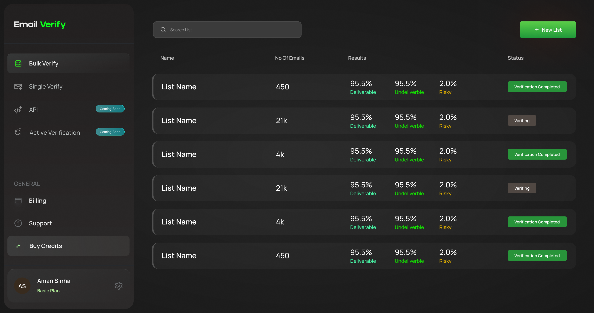

# Bulk Verify Pages - Figma Design

## Figma Source
- **File**: Emailkit
- **File Key**: r2m4Md3beV9KoBbu3ICOR9

| Page | Node ID | URL |
|------|---------|-----|
| Bulk Verify Empty State | 2001:18025 | [Open](https://www.figma.com/design/r2m4Md3beV9KoBbu3ICOR9/Emailkit?node-id=2001-18025&m=dev) |
| Add Emails Modal | 2001:26267 | [Open](https://www.figma.com/design/r2m4Md3beV9KoBbu3ICOR9/Emailkit?node-id=2001-26267&m=dev) |
| Enter Manually | 2001:26428 | [Open](https://www.figma.com/design/r2m4Md3beV9KoBbu3ICOR9/Emailkit?node-id=2001-26428&m=dev) |
| CSV Upload | 2001:26572 | [Open](https://www.figma.com/design/r2m4Md3beV9KoBbu3ICOR9/Emailkit?node-id=2001-26572&m=dev) |
| CSV Column Mapping | 2001:26718 | [Open](https://www.figma.com/design/r2m4Md3beV9KoBbu3ICOR9/Emailkit?node-id=2001-26718&m=dev) |
| CSV Validation Results | 2001:26925 | [Open](https://www.figma.com/design/r2m4Md3beV9KoBbu3ICOR9/Emailkit?node-id=2001-26925&m=dev) |
| Name Your List | 2001:27210 | [Open](https://www.figma.com/design/r2m4Md3beV9KoBbu3ICOR9/Emailkit?node-id=2001-27210&m=dev) |
| Bulk Verify Dashboard | 2001:19811 | [Open](https://www.figma.com/design/r2m4Md3beV9KoBbu3ICOR9/Emailkit?node-id=2001-19811&m=dev) |
| No Search Results | 2001:19989 | [Open](https://www.figma.com/design/r2m4Md3beV9KoBbu3ICOR9/Emailkit?node-id=2001-19989&m=dev) |
| Results - Overview Tab | 2001:20109 | [Open](https://www.figma.com/design/r2m4Md3beV9KoBbu3ICOR9/Emailkit?node-id=2001-20109&m=dev) |
| Results - Email Tab | 2001:22849 | [Open](https://www.figma.com/design/r2m4Md3beV9KoBbu3ICOR9/Emailkit?node-id=2001-22849&m=dev) |
| Email Detail Panel | 2001:25763 | [Open](https://www.figma.com/design/r2m4Md3beV9KoBbu3ICOR9/Emailkit?node-id=2001-25763&m=dev) |
| Results - Exports Tab | 2001:23343 | [Open](https://www.figma.com/design/r2m4Md3beV9KoBbu3ICOR9/Emailkit?node-id=2001-23343&m=dev) |
| Export Emails Modal | 2001:23888 | [Open](https://www.figma.com/design/r2m4Md3beV9KoBbu3ICOR9/Emailkit?node-id=2001-23888&m=dev) |
| Exports Empty State | 2001:23705 | [Open](https://www.figma.com/design/r2m4Md3beV9KoBbu3ICOR9/Emailkit?node-id=2001-23705&m=dev) |
| Export - ReachInbox Login | 2001:24782 | [Open](https://www.figma.com/design/r2m4Md3beV9KoBbu3ICOR9/Emailkit?node-id=2001-24782&m=dev) |
| Export - Where to Export | 2001:25016 | [Open](https://www.figma.com/design/r2m4Md3beV9KoBbu3ICOR9/Emailkit?node-id=2001-25016&m=dev) |
| Export - Add to List | 2001:25244 | [Open](https://www.figma.com/design/r2m4Md3beV9KoBbu3ICOR9/Emailkit?node-id=2001-25244&m=dev) |
| Export - Add to Campaign | 2001:25458 | [Open](https://www.figma.com/design/r2m4Md3beV9KoBbu3ICOR9/Emailkit?node-id=2001-25458&m=dev) |
| Export - Custom Simple | 2001:24157 | [Open](https://www.figma.com/design/r2m4Md3beV9KoBbu3ICOR9/Emailkit?node-id=2001-24157&m=dev) |
| Export - Custom Expanded | 2001:24349 | [Open](https://www.figma.com/design/r2m4Md3beV9KoBbu3ICOR9/Emailkit?node-id=2001-24349&m=dev) |
| Settings - Rename List | 2001:23855 | [Open](https://www.figma.com/design/r2m4Md3beV9KoBbu3ICOR9/Emailkit?node-id=2001-23855&m=dev) |
| List View (All Lists) | 2001:29681 | [Open](https://www.figma.com/design/r2m4Md3beV9KoBbu3ICOR9/Emailkit?node-id=2001-29681&m=dev) |

---

## List View Page (2001:29681)

### Screenshot


### Layout
```
+------------------------------------------------------------------+
|  [Sidebar]  |  [Q Search List____________]        [+ New List]   |
|             |  ──────────────────────────────────────────────────|
|  Bulk Verify|  Name        No Of Emails  Results           Status|
|  Single Ver.|  ──────────────────────────────────────────────────|
|  API [Soon] |  +--------------------------------------------+    |
|  Active [S] |  | List Name    450    95.5%  95.5%  2.0%    |    |
|             |  |                     Deliv. Undel. Risky   |    |
|  ─────────  |  |              [Verification Completed]     | [C]|
|  GENERAL    |  +--------------------------------------------+    |
|  Billing    |  +--------------------------------------------+    |
|  Support    |  | List Name    21k    95.5%  95.5%  2.0%    |    |
|  Buy Credits|  |                     Deliv. Undel. Risky   |    |
|             |  |              [Verifying]                  | [C]|
|  ─────────  |  +--------------------------------------------+    |
|  [User]     |  +--------------------------------------------+    |
|             |  | List Name    4k     95.5%  95.5%  2.0%    |    |
|             |  |                     Deliv. Undel. Risky   |    |
|             |  |              [Verification Completed]     | [C]|
|             |  +--------------------------------------------+    |
+------------------------------------------------------------------+
```

### Table Component

#### Table Headers
| Column | Width | Text Style |
|--------|-------|------------|
| Name | 253px | 12px SemiBold #C6C6C6 |
| No Of Emails | 156px | 12px SemiBold #C6C6C6 |
| Results | ~252px | 12px SemiBold #C6C6C6 |
| Status | ~111px | 12px SemiBold #C6C6C6 |

#### Table Row Card
```css
.list-row {
  background: rgba(255, 255, 255, 0.03);
  border-left: 4px solid #515151;
  border-radius: 16px;
  height: 64px;
  padding: 11px 20px;
}
```

#### Results Column (Sub-columns)
| Metric | Value Color | Label | Label Color |
|--------|-------------|-------|-------------|
| Deliverable | #FFFFFF (18px) | "Deliverable" | #48F4A5 (12px) |
| Undeliverable | #FFFFFF (18px) | "Undeliverble" | #14E101 (12px) |
| Risky | #FFFFFF (18px) | "Risky" | #E1B001 (12px) |

#### Status Badges
| Status | Background | Text |
|--------|------------|------|
| Verification Completed | #28943A | 10px SemiBold white |
| Verifying | #504843 | 10px SemiBold white |

#### "Coming Soon" Badge (Sidebar)
```css
.coming-soon-badge {
  background: linear-gradient(90deg, rgba(90,241,251,0.5) 0%, rgba(1,212,225,0.5) 100%);
  border: 0.5px solid #1CF1FF;
  border-radius: 40px;
  padding: 0 10px;
  font-size: 8px;
  color: white;
}
```

#### Search Input
```css
.search-input {
  background: #3B3B3B;
  border-radius: 8px;
  padding: 12px 17.77px;
  width: 360px;
  box-shadow: inset 0px 0px 0px 0.971px #4D4D4D;
}

.search-placeholder {
  color: #A1A1A1;
  font-size: 10.185px;
}
```

#### New List Button
```css
.new-list-btn {
  background: linear-gradient(180deg, #5ACE49 0%, #229A3C 100%);
  border-radius: 4px;
  padding: 12px 20px;
  width: 137px;
  box-shadow: 0px 0px 100px 0px rgba(255,71,0,0.15);
}
```

---

## Design System

### Color Palette (Bulk Verify specific)
| Token | Hex | Usage |
|-------|-----|-------|
| Modal Background | #262624 | Modal card background |
| Card Background | #333333 | Outer modal shadow layer |
| Option Card Background | #323230 | Selectable option cards |
| Option Card Border | #4d4d4d | Card inset border |
| Icon Background | rgba(255,164,58,0.1) | Icon container bg (#ffa43a @ 10%) |
| File Badge Background | #323230 | Uploaded file name badge |
| File Badge Border | #404034 | Dashed border for drop zone |
| Dropdown Background | #262624 | Select dropdown bg |
| Dropdown Border | #343a40 | Dropdown border |
| Success Toast Background | #242c32 | File processed toast |
| Success Text | #00df80 | Success status text |
| List Row Background | rgba(255,255,255,0.03) | Job list card bg |
| List Row Border | #515151 | 4px left border on list cards |
| Warning Banner Background | #323130 | Credits warning banner |
| Search Input Background | #3b3b3b | Search field bg |

### Progress Bar Gradients
| Status | From | To |
|--------|------|-----|
| Deliverable | #1edf6b | #10793a |
| Risky (blue) | #361fcb | #1b0f65 |
| Unknown (green) | #5cd34a | #2b6d26 |
| Undeliverable (yellow) | #e4b14e | #7e622b |

### Status Badge Colors (Results Overview)
| Status | Badge BG | Text Color |
|--------|----------|------------|
| Deliverable | #3b4f46 | #49ffac |
| Invalid | #4f4d3b | #e1b001 |
| Risky | #3c4f3b | #14e101 |
| Unknown | #3b3f4f | #bb69eb |

### Export Options
| Option | Description | Selection Color |
|--------|-------------|-----------------|
| Maximum Deliverability | Includes deliverable emails only | #4e3628 (selected), border #0dff1d |
| Maximum Reach | Most popular choice for marketers | border #4a4846 |
| Only Bad Emails | Emails that you should avoid | border #4a4846 |
| Custom | Build your own customized export | border #4a4846 |

### Integration Logos (Export Modal)
| Service | Action |
|---------|--------|
| Instantly | Connected - Remove Account (#f84e54) |
| Reply | Connected - Remove Account (#f84e54) |
| Smartlead.ai | Not connected - Add Account (#4ec346) |
| Export CSV File | 1-click automatic Setup |

### Shadow Styles
```css
/* Modal Container Shadow */
box-shadow:
  0px 3.886px 7.771px rgba(0,0,0,0.09),
  0px 7.771px 15.542px rgba(0,0,0,0.09),
  0px 15.542px 31.085px rgba(0,0,0,0.12),
  0px 31.085px 62.169px rgba(0,0,0,0.15),
  0px 62.169px 124.339px rgba(0,0,0,0.18);

/* Modal Inner Border */
box-shadow: inset 0px 0px 0px 0.486px rgba(255,255,255,0.05);

/* Button Inner Shadow */
box-shadow:
  inset 0px -0.5px rgba(0,0,0,0.5),
  inset 0px 0.5px rgba(255,255,255,0.05);

/* Success Toast Shadow */
box-shadow:
  0px 16px 24px rgba(0,0,0,0.14),
  0px 6px 30px rgba(0,0,0,0.12),
  0px 8px 10px rgba(0,0,0,0.2);
```

### Typography
| Element | Font | Size | Weight | Color |
|---------|------|------|--------|-------|
| Page Title | Manrope | 24px | Bold | #ffffff |
| Subtitle | Manrope | 14px | Bold | #ffffff |
| Description | Manrope | 12px | Medium | #b3b3b3 |
| Button Text | Manrope | 11.813px | SemiBold | #ffffff |

---

## Page Designs

### 1. Bulk Verify Empty State

**Route**: `/home/bulk-verify` (when no bulk jobs exist)

```
┌──────────────────────────────────────────────────────────────────────┐
│                                                                      │
│                          ┌────────┐                                  │
│                          │   ✉️   │                                  │
│                          └────────┘                                  │
│                                                                      │
│                Get Started with Bulk Verify                          │
│                                                                      │
│            Start Verifying Emails in Minutes!                        │
│                                                                      │
│     Ready to take your email verification to the next level?         │
│     Our simple, JSON-based API makes it a breeze! With just a        │
│     few lines of code, you can integrate our powerful email          │
│     verification capabilities into your applications and start       │
│     ensuring your outreach hits the mark.                            │
│                                                                      │
│                      ┌─────────────────┐                             │
│                      │      Verify     │                             │
│                      └─────────────────┘                             │
│                                                                      │
└──────────────────────────────────────────────────────────────────────┘
```

**Card Container**
```css
background: #272725;
border-radius: 12px;
width: 683px;
height: 342px;
```

**Icon Container**
```css
background: rgba(255,164,58,0.1);
border-radius: 18.27px;
size: 64px;
/* Envelope icon inside */
```

**Typography**
| Element | Style |
|---------|-------|
| Title | Manrope Bold 24px, #ffffff, "Get Started with Bulk Verify" |
| Subtitle | Manrope Bold 14px, #ffffff, centered |
| Description | Manrope Medium 12px, #b3b3b3, centered, line-height: 20px |

**CTA Button**
```css
background: linear-gradient(180deg, #5ace49 0%, #229a3c 100%);
border-radius: 4px;
padding: 10px 20px;
width: 231px;
font: Manrope SemiBold 11.813px;
color: #ffffff;
```

**Action**
| Element | Action |
|---------|--------|
| Verify | Opens Add Emails modal |

---

### 2. Add Emails Modal

**Route**: `/home/bulk-verify` (modal overlay)

```
┌──────────────────────────────────────────────────────────────────────┐
│                                                                  ✕   │
│  Add Emails                                                          │
│  hh                                                                  │
│                                                                      │
│  ┌─────────────────────────────┐  ┌─────────────────────────────┐   │
│  │  [↑]                        │  │  [≡]                        │   │
│  │  Upload CSV                 │  │  Enter Manually             │   │
│  │  Select and upload a file   │  │  Enter a list of emails     │   │
│  │  from your device           │  │  separated by commash       │   │
│  └─────────────────────────────┘  └─────────────────────────────┘   │
│                                                                      │
│  ┌─────────────────┐                                                 │
│  │    Continue     │                                                 │
│  └─────────────────┘                                                 │
│                                                                      │
└──────────────────────────────────────────────────────────────────────┘
```

**Modal Container**
```css
background: #343433;
border-radius: 12px;
width: 780px;
padding: 32px;
```

**Option Cards**
```css
background: #464644;
border: 1px solid #5a5a58;
border-radius: 8px;
padding: 20px;
width: 340px;
height: 80px;
display: flex;
align-items: center;
gap: 16px;
cursor: pointer;
```

**Option Card (Selected)**
```css
border: 1px solid #5ace49;
```

**Icon Container**
```css
background: rgba(255,164,58,0.1);
border-radius: 12px;
size: 48px;
```

**Typography**
| Element | Style |
|---------|-------|
| Modal Title | Manrope Bold 24px, #ffffff |
| Option Title | Manrope Bold 14px, #ffffff |
| Option Description | Manrope Regular 12px, #a1a1a1 |

**Continue Button**
```css
background: linear-gradient(180deg, #5ace49 0%, #229a3c 100%);
border-radius: 4px;
padding: 12px 48px;
font: Manrope SemiBold 14px;
color: #ffffff;
```

---

### 3. Enter Manually

**Route**: `/home/bulk-verify` (modal step 2 - manual entry)

```
┌──────────────────────────────────────────────────────────────────────┐
│  < Back                                                          ✕   │
│                                                                      │
│  Enter Manually (enter emails separated by comma)                    │
│                                                                      │
│  ┌────────────────────────────────────────────────────────────────┐  │
│  │ user@gmail.com                                                 │  │
│  │ user@gmail.com                                                 │  │
│  │                                                                │  │
│  │                                                                │  │
│  │                                                                │  │
│  │                                                                │  │
│  │                                                                │  │
│  └────────────────────────────────────────────────────────────────┘  │
│                                                                      │
│  ┌─────────────────┐                                                 │
│  │    Continue     │                                                 │
│  └─────────────────┘                                                 │
│                                                                      │
└──────────────────────────────────────────────────────────────────────┘
```

**Modal Container**
```css
background: #343433;
border-radius: 12px;
width: 780px;
padding: 32px;
```

**Back Button**
```css
font: Manrope Medium 14px;
color: #ffffff;
/* Chevron left icon before text */
```

**Textarea**
```css
background: #464644;
border: 1px solid #5a5a58;
border-radius: 8px;
width: 100%;
height: 240px;
padding: 16px;
font: Manrope Regular 14px;
color: #a1a1a1 (placeholder);
color: #ffffff (entered text);
resize: none;
```

**Placeholder Text**
```
user@gmail.com
user@gmail.com
```

---

### 4. CSV Upload

**Route**: `/home/bulk-verify` (modal step 2 - CSV upload)

```
┌──────────────────────────────────────────────────────────────────────┐
│  < Back                                                          ✕   │
│                                                                      │
│  Bulk Email Addition                          See Sample CSV File    │
│                                                                      │
│  ┌────────────────────────────────────────────────────────────────┐  │
│  │                                                                │  │
│  │         [↑]  Drag & Drop CSV file here                        │  │
│  │              Upload from your system, choose file              │  │
│  │                                                                │  │
│  └────────────────────────────────────────────────────────────────┘  │
│                                                                      │
└──────────────────────────────────────────────────────────────────────┘
```

**Modal Container**
```css
background: #343433;
border-radius: 12px;
width: 780px;
padding: 32px;
```

**Header Row**
| Element | Style |
|---------|-------|
| Title | Manrope Bold 16px, #ffffff |
| Sample Link | Manrope SemiBold 14px, #5ace49, cursor: pointer |

**Drop Zone**
```css
background: #464644;
border: 1px dashed #5a5a58;
border-radius: 8px;
width: 100%;
height: 100px;
display: flex;
align-items: center;
gap: 16px;
padding: 24px;
```

**Drop Zone (Drag Over)**
```css
border: 1px dashed #5ace49;
background: rgba(90,206,73,0.05);
```

**Upload Icon**
```css
background: rgba(255,164,58,0.1);
border-radius: 12px;
size: 48px;
/* Upload arrow icon inside */
```

**Drop Zone Text**
| Element | Style |
|---------|-------|
| Primary | Manrope Bold 14px, #ffffff, "Drag & Drop CSV file here" |
| Secondary | Manrope Regular 12px, #a1a1a1, "Upload from your system, choose file" |

---

### 5. CSV Column Mapping

**Route**: `/home/bulk-verify` (modal step 3 - after CSV processed)

```
┌──────────────────────────────────────────────────────────────────────┐
│  < Back                                                          ✕   │
│                                                                      │
│  Bulk Email Addition                          See Sample CSV File    │
│                                                                      │
│  ┌────────────────────────────────────────────────────────────────┐  │
│  │  Copy of bulk connect.CSV                                  ✕   │  │
│  └────────────────────────────────────────────────────────────────┘  │
│                                                                      │
│                    [✓] File Processed                                │
│                                                                      │
│  COLUMN NAME              SELECT TYPE                    SAMPLE      │
│  ─────────────────────────────────────────────────────────────────   │
│  ┌────────────────────────────────────────────────────────────────┐  │
│  │  Email              [Email          ▼]          tim@gmail.com  │  │
│  └────────────────────────────────────────────────────────────────┘  │
│  ┌────────────────────────────────────────────────────────────────┐  │
│  │  Email              [Email          ▼]          tim@gmail.com  │  │
│  └────────────────────────────────────────────────────────────────┘  │
│  ┌────────────────────────────────────────────────────────────────┐  │
│  │  Email              [Email          ▼]          tim@gmail.com  │  │
│  └────────────────────────────────────────────────────────────────┘  │
│                                                                      │
│                      ┌─────────────────┐                             │
│                      │   ↑  Upload     │                             │
│                      └─────────────────┘                             │
│                                                                      │
│            ☐ Exclude Invalid Emails and upload remaining             │
│                                                                      │
└──────────────────────────────────────────────────────────────────────┘
```

**File Badge**
```css
background: #464644;
border-radius: 8px;
padding: 12px 16px;
display: flex;
justify-content: space-between;
align-items: center;
font: Manrope Medium 14px;
color: #ffffff;
```

**Success Badge**
```css
background: transparent;
border: 1px solid #5ace49;
border-radius: 20px;
padding: 8px 16px;
font: Manrope SemiBold 14px;
color: #5ace49;
/* Checkmark icon before text */
```

**Column Mapping Table**
```css
/* Header */
font: Manrope SemiBold 10px;
color: #a1a1a1;
text-transform: uppercase;
letter-spacing: 0.5px;

/* Row */
background: #464644;
border-radius: 8px;
padding: 12px 16px;
margin-bottom: 8px;
```

**Column Mapping Row**
| Column | Width | Content |
|--------|-------|---------|
| Column Name | 200px | CSV column header name |
| Select Type | 180px | Dropdown (Email, Name, etc.) |
| Sample | auto | Preview of first row data |

**Type Dropdown**
```css
background: #343433;
border: 1px solid #5a5a58;
border-radius: 4px;
padding: 8px 12px;
font: Manrope Medium 14px;
color: #ffffff;
/* Chevron down icon */
```

**Upload Button**
```css
background: linear-gradient(180deg, #5ace49 0%, #229a3c 100%);
border-radius: 4px;
padding: 12px 48px;
font: Manrope SemiBold 14px;
color: #ffffff;
/* Upload icon before text */
```

**Checkbox Option**
```css
font: Manrope Regular 14px;
color: #a1a1a1;
/* Unchecked: border #5a5a58, bg transparent */
/* Checked: border #5ace49, bg #5ace49, checkmark white */
```

---

### 6. CSV Validation Results

**Route**: `/home/bulk-verify` (modal - after validation)

```
┌──────────────────────────────────────────────────────────────────────┐
│  < Back                                                          ✕   │
│                                                                      │
│  Bulk Email Addition                          See Sample CSV File    │
│                                                                      │
│  [File + Column Mapping section - same as above]                     │
│                                                                      │
│  ┌────────────────────────────────────────────────────────────────┐  │
│  │  14  Invalid Emails Exist                                      │  │
│  │                                                                │  │
│  │  [3 Invalid SMTP] [3 Invalid Credentials] [3 Unable to conn..] │  │
│  │                                                                │  │
│  │                          ↻ Retry Invalid    ↓ Export Invalid   │  │
│  └────────────────────────────────────────────────────────────────┘  │
│                                                                      │
│  EMAIL              FIRST NAME       LAST NAME         STATUS        │
│  ─────────────────────────────────────────────────────────────────   │
│  tim@reachinbox.ai    Tim             Vadde           Success        │
│  tim1@reachinbox.ai   Tim             Vadde           Pending        │
│  tim1@reachinbox.ai   Tim             Vadde      SMTP Auth Failed ↻  │
│  tim@reachinbox.ai    Tim             Vadde        Already Exists    │
│                                                                      │
└──────────────────────────────────────────────────────────────────────┘
```

**Error Summary Card**
```css
background: #2a2a28;
border-radius: 8px;
padding: 16px;
```

**Error Count**
```css
font: Manrope Bold 24px;
color: #df1e1e;
/* "14" number */
```

**Error Type Badges**
```css
background: #3a3a38;
border-radius: 4px;
padding: 4px 8px;
font: Manrope Medium 12px;
color: #a1a1a1;
/* "3 Invalid SMTP" etc. */
```

**Action Links**
| Action | Icon | Color |
|--------|------|-------|
| Retry Invalid | refresh | #5ace49 |
| Export Invalid | download | #a1a1a1 |

**Results Table**
```css
/* Header */
font: Manrope SemiBold 10px;
color: #a1a1a1;
text-transform: uppercase;

/* Row */
background: #464644;
border-radius: 8px;
padding: 12px 16px;
margin-bottom: 8px;
```

**Status Types**
| Status | Color | Icon |
|--------|-------|------|
| Success | #5ace49 (green) | - |
| Pending | #a1a1a1 (gray) | - |
| SMTP Auth Failed | #df1e1e (red) | refresh icon |
| Already Exists | #f0ca67 (yellow) | - |

---

### 7. Name Your List

**Route**: `/home/bulk-verify` (modal - final step)

```
┌──────────────────────────────────────────────────────────────────────┐
│                                                                  ✕   │
│                                                                      │
│  Name Your List                                                      │
│                                                                      │
│  Add a name to your list to easily manage all verification jobs      │
│                                                                      │
│  List Name                                                           │
│  ┌────────────────────────────────────────────────────────────────┐  │
│  │ enter a name for the list                                      │  │
│  └────────────────────────────────────────────────────────────────┘  │
│                                                                      │
│  ┌─────────────────┐                                                 │
│  │      Save       │                                                 │
│  └─────────────────┘                                                 │
│                                                                      │
└──────────────────────────────────────────────────────────────────────┘
```

**Modal Container**
```css
background: #343433;
border-radius: 12px;
width: 680px;
padding: 32px;
```

**Typography**
| Element | Style |
|---------|-------|
| Title | Manrope Bold 24px, #ffffff |
| Subtitle | Manrope Regular 14px, #a1a1a1 |
| Label | Manrope Medium 12px, #ffffff |

**Input Field**
```css
background: #464644;
border: 1px solid #5a5a58;
border-radius: 8px;
padding: 12px 16px;
font: Manrope Regular 14px;
color: #a1a1a1 (placeholder);
```

**Save Button**
```css
background: linear-gradient(180deg, #5ace49 0%, #229a3c 100%);
border-radius: 4px;
padding: 12px 48px;
font: Manrope SemiBold 14px;
color: #ffffff;
```

---

### 8. Bulk Verify Dashboard (List View)

**Route**: `/home/bulk-verify` (with existing lists)

```
┌──────────────────────────────────────────────────────────────────────┐
│  ⚠ Credits are over. Please buy more credits to verify more emails  │
│                                                      [Buy Credits]   │
├──────────────────────────────────────────────────────────────────────┤
│                                                                      │
│  [🔍 Search List                    ]              [+ New List]      │
│                                                                      │
│  ┌────────────────────────────────────────────────────────────────┐  │
│  │  List Name          Verifying ....        [░░░░░░░░░░░░░░░░]   │  │
│  └────────────────────────────────────────────────────────────────┘  │
│  ┌────────────────────────────────────────────────────────────────┐  │
│  │  List Name     95.5%    [████████████████░░░░]  📋             │  │
│  │                Deliverability                                  │  │
│  └────────────────────────────────────────────────────────────────┘  │
│  ┌────────────────────────────────────────────────────────────────┐  │
│  │  List Name     95.5%    [████████████████░░░░]  📋             │  │
│  │                Deliverability                                  │  │
│  └────────────────────────────────────────────────────────────────┘  │
│  ...                                                                 │
│                                                                      │
└──────────────────────────────────────────────────────────────────────┘
```

**Credits Warning Banner**
```css
background: #2a2a28;
border-radius: 8px;
padding: 12px 16px;
display: flex;
justify-content: space-between;
align-items: center;
/* Warning icon: #f0ca67 */
font: Manrope Medium 14px;
color: #ffffff;
```

**Buy Credits Button (Banner)**
```css
background: #5ace49;
border-radius: 4px;
padding: 8px 16px;
font: Manrope SemiBold 12px;
color: #ffffff;
```

**Search Input**
```css
background: #343433;
border: 1px solid #5a5a58;
border-radius: 8px;
padding: 10px 16px;
width: 300px;
font: Manrope Regular 14px;
color: #a1a1a1;
/* Search icon: #a1a1a1 */
```

**New List Button**
```css
background: #5ace49;
border-radius: 4px;
padding: 8px 16px;
font: Manrope SemiBold 12px;
color: #ffffff;
/* Plus icon before text */
```

**List Row Card**
```css
background: #343433;
border-radius: 8px;
padding: 16px 20px;
margin-bottom: 8px;
display: flex;
align-items: center;
gap: 20px;
```

**List Row - In Progress**
| Element | Style |
|---------|-------|
| List Name | Manrope SemiBold 14px, #ffffff |
| Status | Manrope Regular 12px, #a1a1a1, "Verifying ...." |
| Progress Bar | gray/animated |

**List Row - Completed**
| Element | Style |
|---------|-------|
| List Name | Manrope SemiBold 14px, #ffffff |
| Percentage | Manrope Bold 16px, #ffffff, "95.5%" |
| Label | Manrope Regular 10px, #a1a1a1, "Deliverability" |
| Progress Bar | Stacked colors (green/blue/yellow/red) |
| Copy Icon | Copy to clipboard action |

**Progress Bar (Completed)**
```css
height: 8px;
border-radius: 4px;
/* Segments: */
deliverable: #5ace49 (green)
risky: #5a46d6 (blue/purple)
unknown: #f0ca67 (yellow)
undeliverable: #df1e1e (red)
```

---

### 9. No Search Results

**Route**: `/home/bulk-verify` (empty search state)

```
┌──────────────────────────────────────────────────────────────────────┐
│                                                                      │
│  [🔍 Search List                    ]              [+ New List]      │
│                                                                      │
│                                                                      │
│                         [🔍 illustration]                            │
│                                                                      │
│                    No Search Result Found                            │
│                                                                      │
│     Start adding your email account to start your verification       │
│                                                                      │
│                                                                      │
└──────────────────────────────────────────────────────────────────────┘
```

**Empty State**
```css
display: flex;
flex-direction: column;
align-items: center;
justify-content: center;
padding: 60px;
```

**Illustration**
```css
/* Magnifying glass with motion lines */
width: 120px;
height: 80px;
color: #5a5a58 (gray)
accent: #5ace49 (green ring)
```

**Typography**
| Element | Style |
|---------|-------|
| Title | Manrope Bold 18px, #ffffff, "No Search Result Found" |
| Subtitle | Manrope Regular 14px, #a1a1a1 |

---

## Assets

### Screenshots
```
docs/figma/bulk-verify/screenshots/
├── bulk-verify-empty-state.png  # Getting started / empty state
├── add-emails-modal.png         # Choose upload method modal
├── enter-manually.png           # Manual email entry textarea
├── csv-upload.png               # Drag & drop CSV upload
├── csv-column-mapping.png       # Column type mapping after upload
├── csv-validation-results.png   # Validation errors + results table
├── name-your-list.png           # Name the bulk job modal
├── bulk-verify-dashboard.png    # List of jobs with progress
├── no-search-results.png        # Empty search state
├── results-overview.png         # Overview tab with donut charts
├── results-email-list.png       # Email tab with filter and table
├── email-detail-panel.png       # Full email verification details
├── results-exports.png          # Exports tab with download list
├── export-emails-modal.png      # Export wizard with integrations
├── exports-empty-state.png      # No exports placeholder
├── export-reachinbox-login.png  # ReachInbox login modal
├── export-where-to-export.png   # Campaign vs Lead List choice
├── export-add-to-list.png       # Select existing list dropdown
├── export-add-to-campaign.png   # Select existing campaign dropdown
├── export-custom-simple.png     # Custom export with toggles
├── export-custom-expanded.png   # Full custom export options
└── settings-rename-list.png     # Settings tab - rename/delete list
```

### Icons
```
docs/figma/bulk-verify/icons/
├── upload.svg        # Upload arrow icon
├── list.svg          # List/manual entry icon
├── arrow-back.svg    # Back button chevron
├── check-circle.svg  # Success checkmark
├── clear.svg         # Close/remove X icon
├── file-copy.svg     # Copy to clipboard
└── error-warning.svg # Warning icon for credits banner
```

---

## Implementation Notes

1. **Same pattern as API Empty State**: Reuse the empty state component with different icon and text

2. **Navigation**: Bulk Verify is highlighted in sidebar when on this page

3. **Modal Flow**:
   ```
   Empty State → "Verify" → Add Emails Modal
                              ├── "Upload CSV" → CSV Upload → Column Mapping → Validation Results → Name List
                              └── "Enter Manually" → Manual Entry → Validation Results → Name List
   ```

4. **Option Card Selection**: Only one option can be selected at a time (radio behavior)

5. **CSV Format**: Link to sample CSV file for users to download template

6. **Email Validation**: Validate email format on manual entry before continuing

7. **Error Handling**:
   - Show error count with breakdown by type
   - "Retry Invalid" to re-attempt failed validations
   - "Export Invalid" to download failed emails for review
   - Checkbox to exclude invalid and proceed with valid ones

8. **Status Types**:
   - Success (green) - Email verified successfully
   - Pending (gray) - Awaiting verification
   - SMTP Auth Failed (red + retry) - Authentication error, can retry
   - Already Exists (yellow) - Duplicate email in system

9. **Dashboard Features**:
   - Credits warning banner when low/empty
   - Search to filter lists by name
   - Progress bar shows verification status breakdown
   - Copy icon to copy results

10. **Real-time Updates**: Use SSE to update progress bar and status during verification
